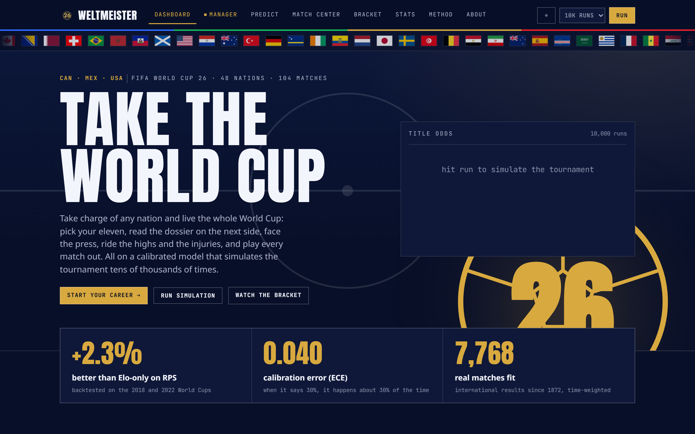
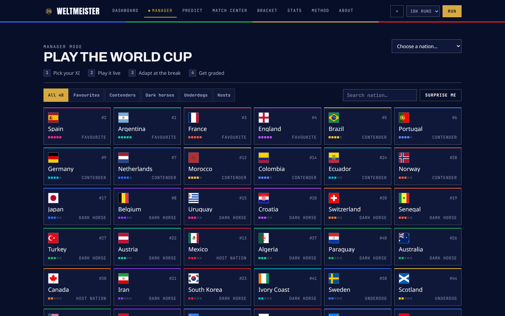

<div align="center">


### A calibrated prediction engine, tournament simulator, and manager-mode web app for the 2026 World Cup

Predict every match. Simulate the whole tournament tens of thousands of times. Watch any game play out with lineups and player ratings. Then take charge of a nation and live the whole World Cup.

[**▶ Live demo**](https://weltmeister-nine.vercel.app)


<br />

<a href="https://weltmeister-nine.vercel.app">
  
</a>

<br /><br />

**Built by Subhan Razzaq and Youssef Khafagy**

</div>

---

## ⚽ Overview

WELTMEISTER is a real statistical model wrapped in a broadcast-grade web app. A Dixon-Coles goals model is fit offline in Python on more than a century of real international results, validated against past World Cups, and exported as a single data artifact. A dependency-free TypeScript Monte Carlo engine then simulates the full 2026 tournament in the browser, in a Web Worker, so the predictions, the live bracket, and the manage mode all run client side with no backend.

It is built to be defensible and genuinely usable, not a demo. Every number traces back to a fitted model or a simulated event, every run is reproducible from a seed, and the whole thing deploys as a static site.

## 📊 At a glance

- **Beats an Elo-only baseline** on Ranked Probability Score across the 2018 and 2022 World Cups, and is calibrated to an expected calibration error of **0.040**.
- **1248 real players** from the official 2026 squads, each with a real photo and an overall matched to EA Sports FC 26, projected elevens, a goalscorer model, and per-game player ratings.
- **48 teams, 12 groups, 104 matches**, the real Round of 32 bracket built from FIFA's official Annex C third-place table, extra time, and penalty shootouts.
- **A living manager career**: a club-style inbox, press conferences, player form and squad morale, injuries, opponent managers, live commentary, back-page news and an end-of-run awards ceremony.
- **Tens of thousands of tournaments per run**, aggregated into title odds, per-round survival odds, and a Golden Boot race.
- **57 unit tests** plus continuous integration, an analytic-gradient check on the model fit, the full Annex C allocation, and a hand-checked bracket reproduced from a fixed seed.
- **Static and instant.** The heavy fit runs offline, the runtime is a seeded Web Worker, and manager-mode re-sims feel immediate.

## 🎮 What you can do

This is a full product, not a single chart. Each view is driven by the same engine and the same seed.

- **Predictions.** Win, draw and loss odds for every fixture, a most likely scoreline, a full Dixon-Coles scoreline heatmap, and group tables that fill in with advancement and round-of-16 probabilities.
- **Build your own bracket.** Order all twelve groups, then choose which eight of the twelve third-placed teams advance. Your picks drop into their real Round of 32 slots using FIFA's published Annex C combination table, so every bracket you build is a draw that could actually happen. Click through the knockouts to a champion, then have the model grade the call across tens of thousands of tournaments. Share the whole thing as a short seeded link.
- **Match Center.** Browse the actual result of a simulated run game by game, group stage included. Open any match for a broadcast detail: the model's pre-match scoreline odds with the real result marked, a two-sided timeline of goals, assists, bookings and substitutions with minutes, and a FotMob-style lineup pitch where every player lines up in the team's real shape and position with a jersey number, a colour-graded match rating, and the man of the match. Each side uses the formations it actually plays, weighted, so the shape varies between games.
- **Live bracket.** The 48-to-1 knockout reduction rendered as a broadcast reveal, round by round, with a gold trophy locking onto the champion. It never runs on its own: the page waits in a pristine, unsimulated state until you start a run, so the bracket you see is always one you asked for. Share it as a seeded link or export it as a poster image.
- **Stats.** The Golden Boot race, top assists, and clean sheets, projected as expected values across the whole Monte Carlo run.
- **Manager mode.** Take charge of any of the 48 nations and live the whole World Cup, one match at a time. It is the headline feature and has a section of its own below.
- **Methodology.** The data, the model, the metrics, the baselines beaten, and the calibration reliability diagram, all on one recruiter-facing page.

Light and dark themes, keyboard navigation, visible focus, reduced-motion fallbacks, and a responsive layout are built in.

## 🎯 Manager mode: a living career

The headline feature. Pick a nation from the full field, set your shape and your eleven on a drag-and-drop pitch, then steer the squad through the World Cup. Everything around the match is built to make it feel like a season, not a single game.

<div align="center">

<a href="https://weltmeister-nine.vercel.app/manage">
  
</a>

</div>

<div align="center">

| Feature | What it does |
| :------ | :----------- |
| 📥 **Inbox & dossiers** | A club-style inbox of messages from the assistant, medical staff, discipline office and board. The assistant's pre-match dossier opens a layered analysis pane on the next opponent. |
| 🎤 **Press conferences** | A real interview-board backdrop, the question typed out live, and dialogue choices that move dressing-room morale and the fans either way. |
| 💪 **Form & morale** | Rolling player form and squad morale move with results, minutes and your press answers, shift the displayed overall, and feed the team rating through a chemistry factor, just like fatigue. |
| 🤕 **Injuries & illness** | Seeded knocks and bugs strike between games, rule players out, surface in the medical inbox, and tick down to recovery. |
| 🧑‍✈️ **Opponent managers** | Every side has a head coach with a one-to-five-star reputation, sized up on the matchup and in the dossier. |
| 📝 **Live commentary** | Goals, cards and atmosphere lines drop onto the feed minute by minute as the clock ticks. |
| 📰 **Back-page news** | Every result writes its headlines, and a click opens a full newspaper front page with stories from across the tournament. |
| 🏆 **Awards ceremony** | At the end of a run the honours are handed out: Golden Boot, Golden Ball, Golden Glove, Best Young Player and the Team of the Tournament, each beside the winner's photo and a faux-3D trophy. |

</div>

Underneath it all is the same Dixon-Coles engine. The formation leans the attack and defence split, a player fielded out of position is docked, the tactical sliders shift expected goals, a stronger eleven than your projected one lifts the side while a weaker one dents it, and stamina drains with minutes played until the penalty turns steep and a rotation is forced. Matches are not revealed as a final score, they are played out: a clock ticks from kick-off, you can pause at any stoppage or at half-time to make up to five substitutions and re-set the shape, and the remaining minutes simulate with those exact choices, through extra time and penalties. Player overalls match EA Sports FC 26, so the modern elite (Dembele, Yamal, Mbappe, Kane, Salah, Olise) sit at the top and a higher-rated pick genuinely plays better. A live tracker shows your group table, the qualification race and your knockout path, the run is saved so you can pick it up later, and at the final whistle of the tournament your campaign is graded against the model's own expectation for the team.

## 🧮 The model

Each match is a **Dixon-Coles adjusted Poisson**. Every team carries an attack rating and a defence rating, and the expected goals for the home side are `exp(mu + atk_home - def_away + host)`, with the symmetric term for the away side. The Dixon-Coles low-score correction couples the 0-0, 1-0, 0-1 and 1-1 cells so they are not treated as independent.

The ratings are fit by maximum likelihood on real international results going back to 1872, with an exponential time decay so recent and important matches count for more. Because national teams play few games, the maximum likelihood fit is blended with two priors:

- an **Elo rating** computed in repo from the same results, which anchors teams with little recent form,
- a **squad-quality** estimate aggregated from the official 26-player squads, which is what makes manage mode meaningful.

The optimiser uses a hand-derived **analytic gradient**, checked against finite differences in the test suite, so the fit is fast and exact.

## ✅ Does it actually work

The engine ships its own validation. It is backtested on the 2018 and 2022 World Cups, fitting only on matches before each tournament and forecasting every game, then scored against an Elo-only baseline and a uniform baseline. Lower is better on all three metrics.

<div align="center">

| Model           |        RPS |      Brier |   Log-loss |
| :-------------- | :--------: | :--------: | :--------: |
| **WELTMEISTER** | **0.2091** | **0.5901** | **1.0068** |
| Elo only        |   0.2140   |   0.5972   |   1.0131   |
| Uniform         |   0.2413   |   0.6667   |   1.0986   |

</div>

The model beats the Elo-only baseline on Ranked Probability Score by **2.3 percent** across the two tournaments, and on all three metrics combined. It is well calibrated, with an expected calibration error of **0.040**, so when it says 30 percent the event happens about 30 percent of the time. The full breakdown and the reliability diagram live on the methodology page.

## ⚙️ The simulation engine

One tournament plays all 72 group matches, builds the twelve tables with the official 2026 tie-breakers, selects the eight best third-placed teams, and assembles the real Round of 32 bracket. Which third-placed team meets which group winner comes straight from FIFA's published Annex C table, all 495 combinations of it, so every bracket the engine builds is a draw that could really occur, not just a plausible-looking one. The knockouts then run with extra time and a penalty shootout, and the Monte Carlo layer repeats the whole tournament tens of thousands of times from a base seed and aggregates the results.

The engine is pure TypeScript with a deterministic seeded generator and no dependencies in the hot loop. A cached Dixon-Coles scoreline distribution keeps the inner sampler fast, and the whole thing runs in a Web Worker so the interface never blocks. The same seed and the same model always produce the same tournament, which is why every bracket is shareable and verifiable. A separate, display-only enrichment layer adds the broadcast detail a viewer expects, the minute of each goal, both lineups, bookings, substitutions and player ratings, derived from a side stream so it never disturbs the validated core.

## Architecture

The heavy model fitting happens offline in Python and exports one compact data artifact. The simulation that consumes it runs in the browser, so the whole site deploys static with no backend and no per-request cost.

```
weltmeister/
  engine/                  Python offline model
    src/ingest.py          pull and clean the data sources
    src/elo.py             World Football Elo, computed from results
    src/ratings.py         Dixon-Coles MLE with priors and analytic gradient
    src/real_squads.py     parse the official 2026 squads and curated overalls
    src/ea_ratings.py      match player overalls to EA Sports FC 26
    src/photos.py          resolve a Commons photo for every player
    src/scorers.py         player goal-share model
    src/export.py          write model.json
    validate/              backtest, metrics, calibration
  sim/                     runtime Monte Carlo, shared and dependency free
    src/poisson.ts         Dixon-Coles scoreline sampling
    src/group.ts           group tables and 2026 tie-breakers
    src/thirdsTable.ts     FIFA Annex C third-place allocation, all 495 combos
    src/bracket.ts         R32 build, knockouts, extra time, penalties
    src/montecarlo.ts      N-run aggregation
    src/enrich.ts          per-match timeline, lineups and player ratings
    src/worker.ts          Web Worker entry
  web/                     React app
    src/features/manage/   career: inbox, press, live match, awards
    src/lib/               morale, form, events, news, press, awards, managers
    src/components/        lineup pitch, player avatars, match detail, charts
    public/data/model.json committed engine output
```

## Engineering

- **Type safe.** TypeScript strict across the simulation and the app, Python typed where it helps.
- **Reproducible.** Every simulation is seeded, so any run can be shared by URL and reproduced exactly, down to the goal minutes.
- **Tested.** 57 unit tests covering the analytic-gradient fit, the scoring-rule metrics, hand-checked group tables, a hand-checked bracket on a fixed seed, the live match playback, and the official third-place allocation verified across all 495 qualifying combinations.
- **CI.** Continuous integration runs the engine validation and the simulation tests on every push.
- **Performant.** The Monte Carlo runs off the main thread with a cached scoreline distribution, so re-sims stay responsive even at tens of thousands of runs.
- **Accessible.** Keyboard navigable, visible focus, light and dark themes, reduced-motion fallbacks, and a mobile-friendly layout.

## Tech stack

- **Engine** Python with numpy, pandas and scipy for the fit, the backtest and the calibration.
- **Simulation** dependency-free TypeScript, a seeded Monte Carlo core in a Web Worker.
- **Web** React 18, Vite, TypeScript strict, Zustand for state, Framer Motion for the broadcast bracket reveal, D3 and hand-built SVG for the charts.
- **Deploy** Vercel, static.

## 🚀 Run it locally

Requires Node 20+, pnpm, and Python 3.12 with uv.

```bash
# install the workspace
pnpm install

# run the app
pnpm dev

# run the simulation tests
pnpm --filter @weltmeister/sim test
```

Regenerate the model artifact and the validation report from the engine when needed:

```bash
cd engine
uv venv && uv pip install numpy pandas scipy requests matplotlib pytest ruff
.venv/bin/python -m src.export                 # writes web/public/data/model.json
.venv/bin/python -m validate.backtest --save   # the validation report
```

## Data sources

- The martj42 international results dataset, 1872 to present, the backbone for the goals fit.
- World Football Elo, computed in repo from those results, used as a prior and as the baseline.
- The official 2026 squad lists, for the projected elevens, the scorer model, and jersey numbers. Player overalls and ages are matched to the EA Sports FC 26 ratings, resolved per player by nationality and name, so the numbers line up with what a player of football expects. Anyone the dataset does not list falls back to a curated star list, then a club-and-caps heuristic.
- Player photos from Wikimedia Commons, resolved through the MediaWiki API by the exact article each player's squad entry links to, so the photo always belongs to the right footballer. The resolved URLs are cached into a committed artifact.
- FIFA's Annex C third-place combination table for the Round of 32, transcribed and verified against the slot eligibility rules for all 495 combinations.

Everything is pulled once, cached locally, and frozen into the committed artifact. Nothing is fetched from a model source at page load. The only thing the browser loads live is the player photos, straight from the Wikimedia image CDN, with a clean fallback avatar when a player has no free photo.

## Note

An independent portfolio project. Not affiliated with or endorsed by FIFA. The visual identity is original work in the spirit of the 2026 tournament: a deep-blue broadcast base, sharp edges, and a restrained colourblock band drawn from the three host nations and the prize gold rather than a full rainbow. Country markers are the real national flags. The same theme drives the in-app views and the exported posters, so a shared image always matches what you saw on screen. Player photographs come from Wikimedia Commons under their respective Creative Commons or public-domain licences, with a neutral fallback avatar for anyone without a free photo.
